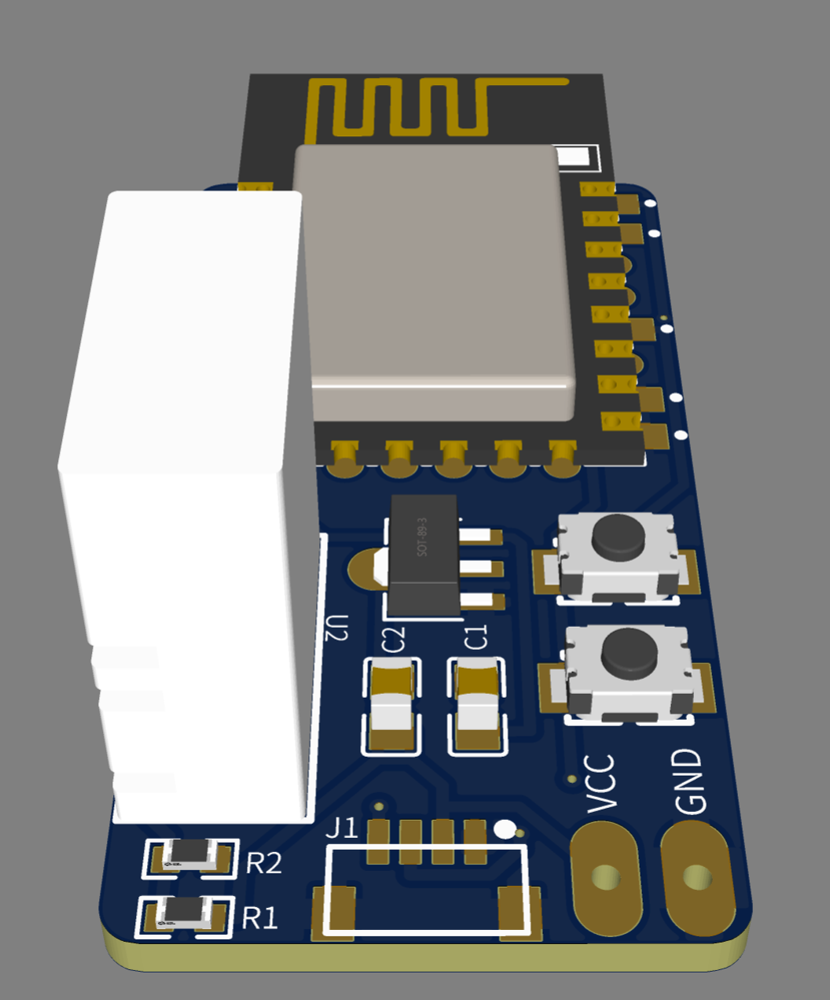

# Thermo-hygro-sensor
An tiny ultra low power thermo-hygro sensor made with a DHT22 sensor and ESP8266 micro-controller. It collects data for temperature and humidity. Extremely optimized for running on a 18650 Li-ion battery for more than 5 months without recharge.

# Hardware requirements
- ESP-8266 micro-controller
  - The project's target is ESP-07 or ESP-12 family. But any 8266 family should be fine. Make sure your board have enough free GPIO pins for connecting DHT22 sensor
- DHT-22 themperature & humidity sensor
- HT7333 LDO voltage regulator. Or any other with low quiescent current. HT7333 is 4μA in stand-by without load.
- Two capacitors of 10μF
- Some connecting wires

# Schematics
## PCB V3

